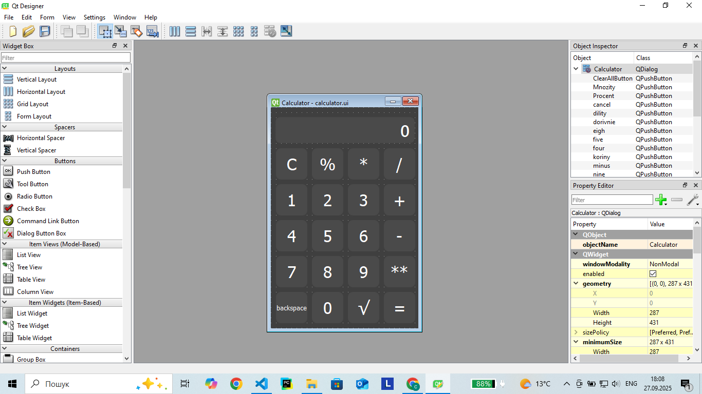
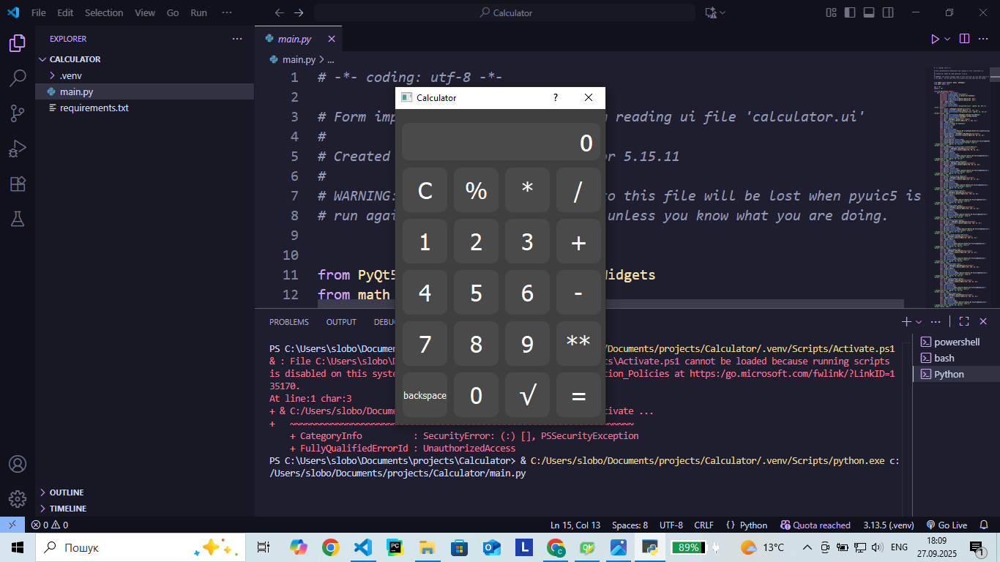

# Простий калькулятор на Python з використанням бібліотеки PyQt5
Простий калькулятор з графічним інтерфейсом, який створений на **Python** з використанням **PyQt5** та графічним редактором **QT Designer**. Підтримує базові математичні операції, такі як: **Додавання**, **Ділення**, **Віднімання**, **Множення**, **Квадратний корінь** тощо.
---
## 📷 Скріншоти


---
## ⚙ Встановлення

Вимоги:
- [Python 3.10+](https://www.python.org/)
- [PyQt5](https://pypi.org/project/PyQt5/)
- [QT Designer (необов'язково)](https://build-system.fman.io/qt-designer-download)

Встановлення:
```bash
pip install pyqt5
```

## 👤 Автор
- Вячеслав Слободянюк 
- [GitHub](https://github.com/KeyProgQ)  
- [Email](mailto:slobodanukvaceslav8@gmail.com)
- [TikTok](https://www.tiktok.com/@ukrprogger)
- [Telegram](https://t.me/ukrprogger)
